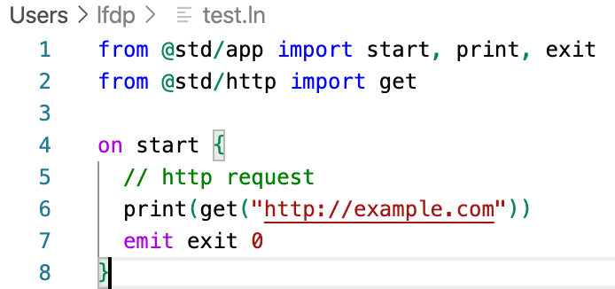

# alan-lang README

This is a vscode extension to support syntax highlighting for the [Alan Programming Language](https://alan-lang.org).

## Features

Syntax Highlighting for `.ln`, `.amm`, and `.aga` files

## License

MIT
